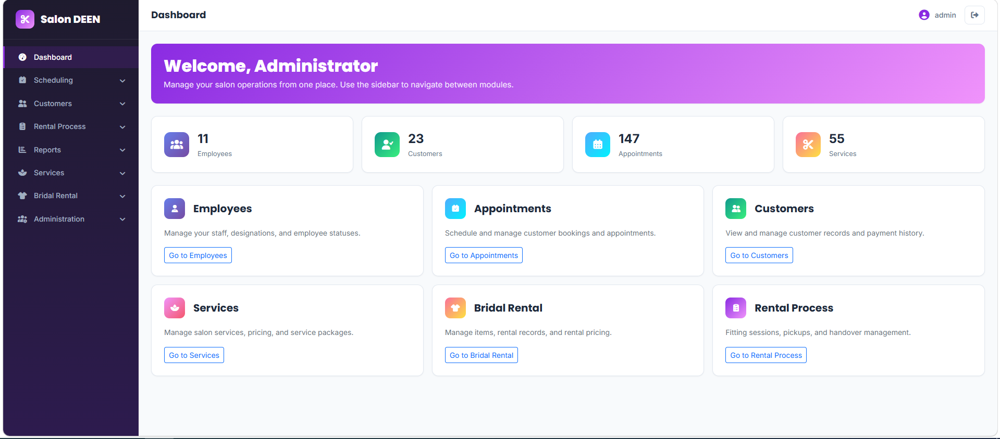

# Salon Appointment & Bridal Dressing Rental Management System

A full-stack web-based management system developed for **SALON DEEN**, a women's beauty salon located in Kegalle, Sri Lanka.

The system combines **salon appointment management** and **bridal dressing rental management** into a single platform, replacing several manual record-keeping processes with a centralized digital system.

---

## 📌 Project Overview

SALON DEEN previously managed many appointment and bridal rental activities using handwritten record books. This created challenges such as appointment conflicts, difficulty tracking customer information, rental management difficulties, inconsistent records, and time-consuming manual processes.

This project provides a computerized solution for managing:

- Customer information
- Salon appointments
- Salon services and packages
- Employee information
- Employee availability and leave plans
- Bridal dressing items
- Bridal rental bookings
- Fitting sessions
- Pickup and handover processes
- Payments
- User accounts and privileges
- Reports and operational information

The system was developed as a final-year project for the **Bachelor of Information Technology at the University of Colombo School of Computing (UCSC)**.

---

## 🎯 Project Objectives

The main objectives of the system are to:

- Reduce paper-based record keeping by moving appointment and bridal rental management to a digital platform.
- Reduce appointment clashes and double bookings through structured scheduling.
- Reduce the time spent on manual booking activities.
- Improve the accuracy of customer information and booking history.
- Make appointment and rental reservation processes more efficient.
- Improve coordination between salon employees and management.
- Improve overall operational efficiency.
- Provide organized and reliable access to business information.

---

## ✨ Key Features

### 👩 Customer Management

- Add and manage customer information
- Maintain customer contact details
- View customer booking history
- Retrieve customer information efficiently

### 📅 Appointment Management

- Create salon appointments
- Select salon services and service packages
- Check employee availability
- Manage appointment dates and times
- Calculate service duration
- Calculate appointment charges
- Manage appointment status
- Prevent overlapping appointments and double bookings

### 💇 Service & Package Management

- Manage salon services
- Manage service prices
- Manage service packages
- Manage package pricing
- Configure service availability

### 👩‍💼 Employee Management

- Manage employee information
- Assign employee roles
- Manage employee schedules
- Manage employee availability
- Maintain monthly leave plans

### 👗 Bridal Dressing Rental Management

- Manage bridal rental items
- Manage item categories and designs
- Create rental bookings
- Generate rental codes
- Manage rental charges
- Manage rental payments
- Track rental status

### 👰 Fitting / Fit-on Management

- Schedule fitting sessions
- Manage fitting dates
- Connect fitting activities with rental bookings
- Validate fitting schedules according to rental dates

### 📦 Pickup Management

- Schedule customer pickup
- Manage pickup information
- Maintain pickup checklist information
- Track rental item collection

### 🤝 Handover Management

- Manage rental item handover
- Record returned rental items
- Check item condition during return
- Handle damaged items
- Handle lost items
- Update item status based on return condition

### 💳 Payment Management

- Manage salon appointment payments
- Manage bridal rental payments
- Record advance payments
- Record remaining balances
- Manage rental key money
- Manage payment methods
- Maintain payment records

### 🔐 User & Privilege Management

- User authentication
- Role-based access
- User management
- Privilege management
- Restrict access according to assigned permissions

### 📊 Dashboard & Reports

- Dashboard for daily operational information
- Appointment-related information
- Rental information
- Customer information
- Payment information
- Revenue and operational reports

---

## 🏗️ System Architecture

The system follows the **Model-View-Controller (MVC)** architectural pattern.

### Model

Responsible for:

- Data management
- Business logic
- Database operations
- Business validations
- Maintaining data consistency

### View

Responsible for:

- User interfaces
- Forms
- Tables
- Dashboards
- User interaction

### Controller

Responsible for:

- Processing user requests
- Validating input
- Communicating with the model
- Returning appropriate responses

---

## 🛠️ Technologies Used

### Backend

- Java 21
- Spring Boot
- Spring Data JPA
- Spring Security
- Hibernate
- Thymeleaf
- Lombok

### Frontend

- HTML5
- CSS3
- Bootstrap 5
- JavaScript
- jQuery

### Database

- MySQL

### Build & Development Tools

- Gradle
- Visual Studio Code
- MySQL Workbench
- Google Chrome
- Git
- GitHub

---

## 🗄️ Database

The system uses **MySQL** as the relational database management system.

The database stores information related to:

- Customers
- Employees
- Services
- Service packages
- Appointments
- Leave plans
- Rental items
- Rentals
- Fitting sessions
- Pickup records
- Handover records
- Payments
- Users
- Privileges

---

## 🧪 Testing

The system was evaluated using several software testing approaches:

- Unit Testing
- Integration Testing
- System Testing
- Security Testing
- User Acceptance Testing

Testing was performed to verify individual modules, interactions between modules, complete system functionality, security and user requirements.

---

## 📋 System Requirements

### Software Requirements

- Windows 10 or higher
- Java Development Kit (JDK 21)
- Spring Boot
- Gradle
- MySQL Server
- MySQL Workbench
- Visual Studio Code
- Google Chrome or another modern web browser
- Git

---

## ⚙️ Installation & Setup

### 1. Clone the repository

```bash
git clone https://github.com/rishini2000/salon-appointment-bridal-rental-management-system.git

```

### 2. Open the project

Open the cloned project in Visual Studio Code.

### 3. Set up the database

Create a MySQL database named `sdb` and import the provided `schema.sql` file. The `data.sql` file contains sample data for development.

### 4. Configure database credentials

Set the `DB_PASSWORD` environment variable to your local MySQL password. Update the database URL and username in `application.properties` if your configuration is different.

Never commit database passwords or other sensitive credentials to GitHub.

### 5. Build and run the application

On Windows, open a terminal in the project directory and run:

```bash
.\gradlew.bat build
```

Start the application:

```bash
.\gradlew.bat bootRun
```

### 6. Open the application

Open your browser and visit:

http://localhost:8081

Log in using an authorized account.

---

## 📸 Screenshots

## 📸 Screenshots

### Dashboard

The dashboard provides an overview of salon operations, including employees, customers, appointments, services, bridal rental management, and rental processes.


---

## 📚 Project Documentation

The project includes requirements analysis, UML diagrams, ER diagrams, implementation details, testing documentation, and user manuals.

---

## 👩‍💻 Developer

**I.M.R.T. Ilanganthilaka**

Bachelor of Information Technology  
University of Colombo School of Computing

**GitHub:** https://github.com/rishini2000

**LinkedIn:** https://www.linkedin.com/in/rishini-ilanganthilaka-463076317/

---

## 🎓 Academic Project

Developed as a final-year project for the Bachelor of Information Technology degree at the University of Colombo School of Computing (UCSC).

## 📄 License

Developed for academic and portfolio purposes. No open-source license has been specified.